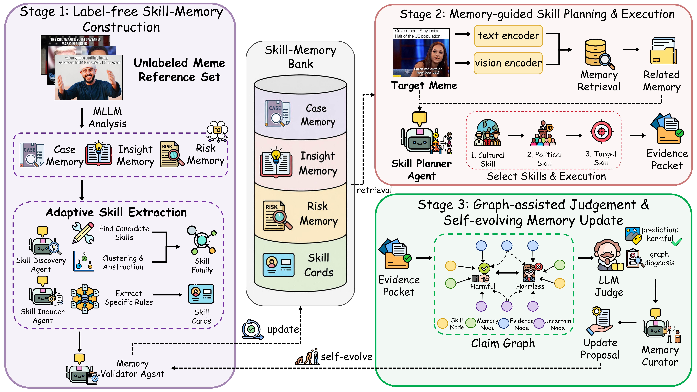

# HarmEvoSkill: Skill-Memory Self-Evolution for Zero-shot Multimodal Harmful Meme Detection

This is the official repository for: **HarmEvoSkill: Skill-Memory Self-Evolution for Zero-shot Multimodal Harmful Meme Detection** Accepted by **EMNLP 2026 Findings**.

  

## News

- `2026/08` 🎉 HarmEvoSkill is accepted to **EMNLP 2026 Findings**!
- `2026/08` 🚀 We release the code of HarmEvoSkill!

## Overview

HarmEvoSkill introduces a self-evolving Skill-Memory framework that learns reusable reasoning experience from unlabeled multimodal memes.

The framework consists of three components:

1. **Skill-Memory Construction**
   - Builds reusable Case, Insight, and Risk Memory from unlabeled reference data.

2. **Memory-Guided Skill Planning**
   - Retrieves relevant experience and selects executable reasoning skills for each meme.

3. **Evidence-Grounded Judgement and Memory Evolution**
   - Constructs claim-evidence graphs for final decisions and updates memory through validated proposals.

## Keywords

multimodal safety, harmful meme detection, memory-augmented agents, skill evolution, multimodal reasoning

## Repository Structure
